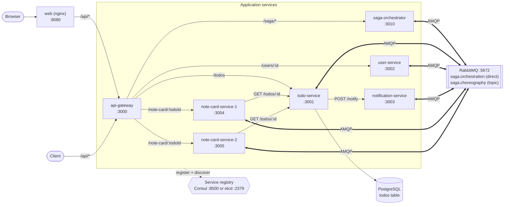
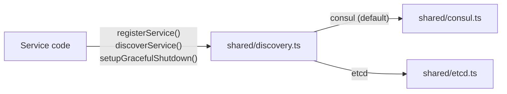
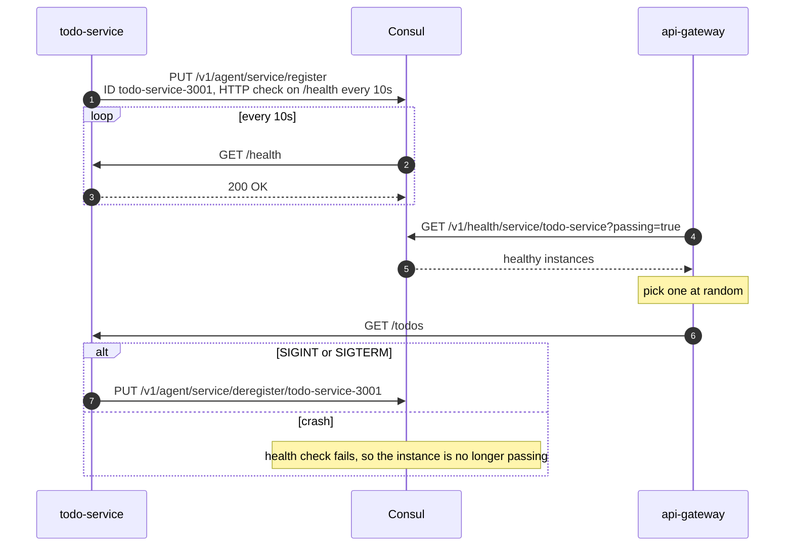
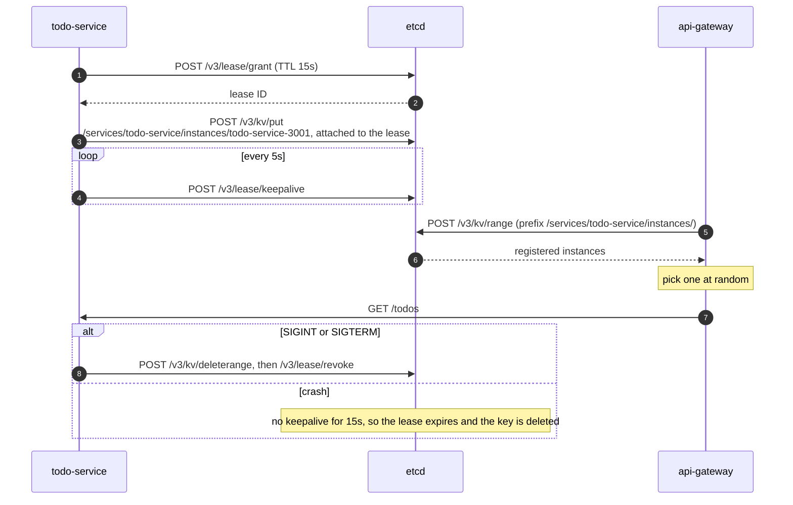
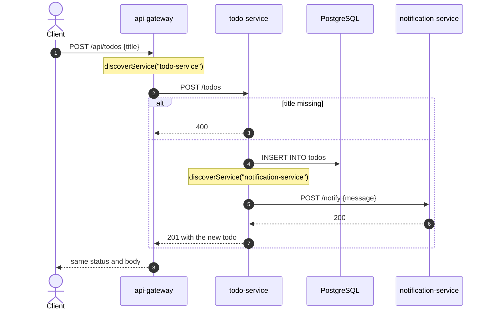
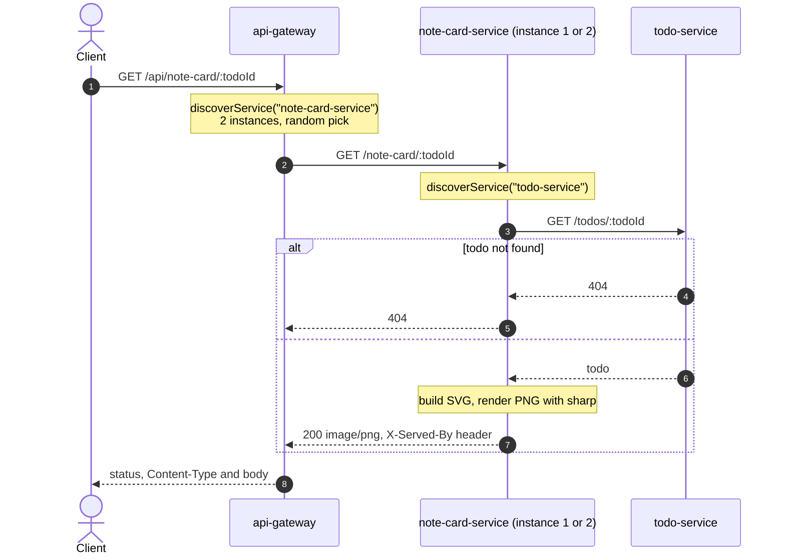
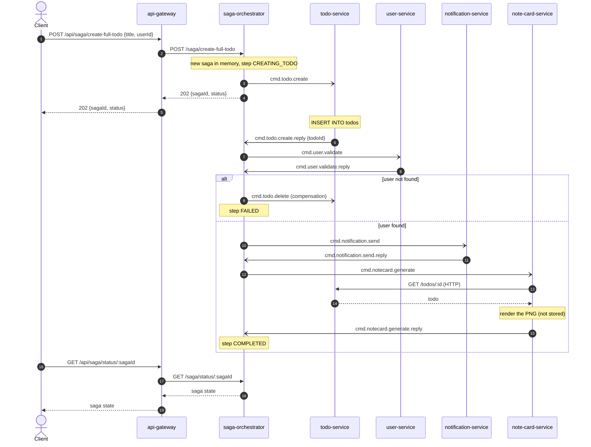
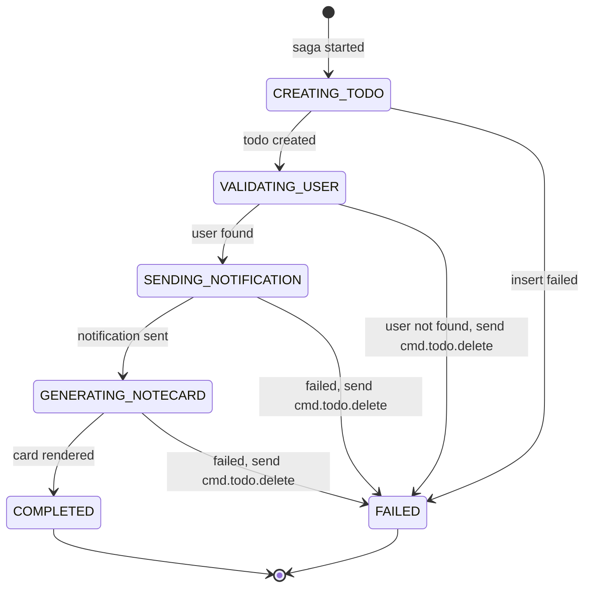
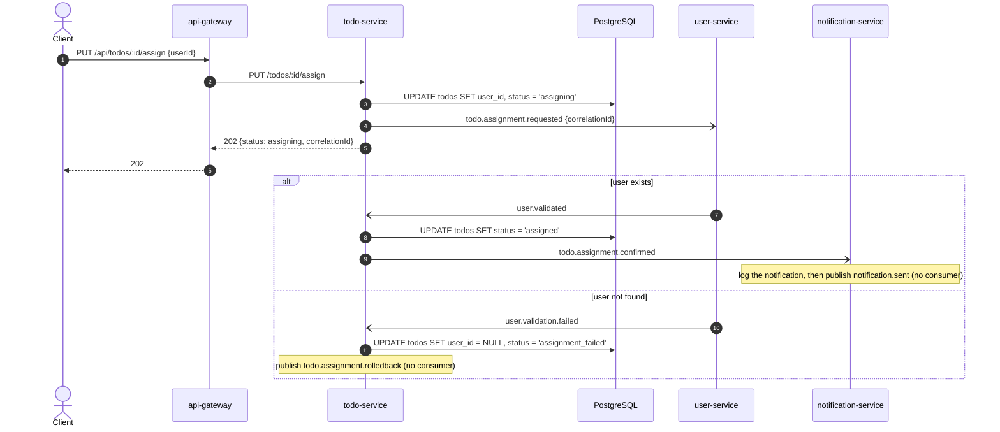
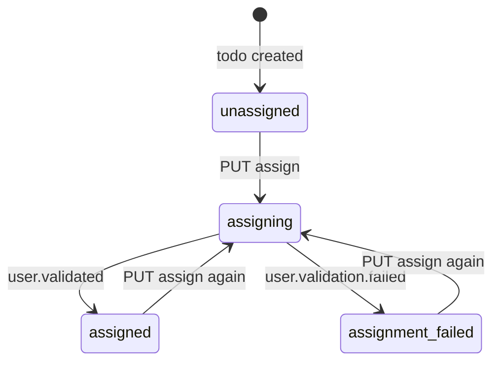

# Architecture

> This copy describes the **`feature/saga-pattern`** branch. Each feature branch has its own copy of this file, extended with what that branch adds:
>
> | Branch | Adds |
> |---|---|
> | `main` | HTTP microservices, PostgreSQL, client-side discovery with Consul or etcd, React web UI |
> | `feature/saga-pattern` | RabbitMQ, `saga-orchestrator`, orchestration and choreography sagas |
> | `feature/kubernetes` | Kubernetes manifests and a DNS-based discovery backend |
> | `feature/k8s-service-mesh` | Linkerd sidecars, mTLS, retry and timeout policies |

The diagrams are [Mermaid](https://mermaid.js.org/). GitHub renders them inline, and [mermaid.live](https://mermaid.live) is handy for editing them.

## System overview

- Solid arrows are HTTP calls, and thick arrows are AMQP connections to RabbitMQ. Every service registers itself in the registry on startup, and every caller looks up a healthy instance before each HTTP call (dotted arrow).
- `note-card-service` runs as two instances under one service name. Callers pick one of them at random.
- `user-service` serves three hardcoded users, and `notification-service` only logs what it receives.
- `web` is the React UI. nginx serves the bundle and proxies `/api/*` to the gateway on the same origin, because the gateway sends no CORS headers. It isn't registered in the registry.
- `todo-service` creates the `todos` table (`id`, `title`, `completed`, `user_id`, `status`) on startup. It retries 5 times, 2s apart, while PostgreSQL starts.

The gateway is the only entry point:

| Gateway route | Forwards to |
|---|---|
| `GET /api/todos`, `POST /api/todos` | todo-service `/todos` |
| `GET /api/todos/:id`, `DELETE /api/todos/:id` | todo-service `/todos/:id` |
| `PUT /api/todos/:id/assign` | todo-service `/todos/:id/assign` (starts the choreography saga) |
| `GET /api/users/:id` | user-service `/users/:id` |
| `GET /api/note-card/:todoId` | note-card-service `/note-card/:todoId` (binary passthrough) |
| `POST /api/saga/create-full-todo` | saga-orchestrator `/saga/create-full-todo` (starts the orchestration saga) |
| `GET /api/saga/status/:sagaId` | saga-orchestrator `/saga/status/:sagaId` |

If discovery or the downstream call throws, the gateway answers `503 {"error": "<service> unavailable"}`.

## Service discovery

Services never hardcode each other's addresses. They import [`shared/discovery.ts`](../shared/discovery.ts), which loads a backend at startup based on `DISCOVERY_BACKEND`:

Both backends use **client-side discovery**: the registry returns every live instance, and the caller picks one at random. That random pick is what spreads traffic across the two note-card instances.

### Consul

Consul owns the health checks. It polls each instance's `/health` endpoint and only returns instances whose check passes.

### etcd

etcd is only a key-value store, so a service proves it is alive by renewing a lease. If the renewals stop, etcd deletes the key.

### Consul vs etcd

| | Consul ([`consul.ts`](../shared/consul.ts)) | etcd ([`etcd.ts`](../shared/etcd.ts)) |
|---|---|---|
| Who checks health | Consul polls `/health` (server-side) | The service renews its lease (client-side) |
| Registration | One API call | Grant a lease, put the key, start a keepalive timer |
| Discovery query | `GET /v1/health/service/{name}?passing=true` | Prefix range on `/services/{name}/instances/` |
| A crashed instance disappears after | The next failed check (every 10s) | The lease TTL (15s) |
| State kept inside the service | None | Lease ID and keepalive timer |

## Request flows

### Create a todo

`todo-service` waits for the notification call, but if it fails the error is only logged. The todo is already saved, so a notification failure doesn't fail the request.

### Render a note card

The serving instance's ID is drawn on the card. The gateway copies only `Content-Type`, so the `X-Served-By` header is visible only when you call an instance directly on `:3004` or `:3005`.

## Messaging (RabbitMQ)

Every service except the gateway opens an AMQP connection on startup and calls `setupExchanges()` in [`shared/rabbitmq.ts`](../shared/rabbitmq.ts). That call declares both exchanges and one durable queue per routing key (`saga.<key>` and `choreography.<key>`). It is idempotent, so startup order doesn't matter. Consumers use manual acks with `prefetch(1)`. If a handler throws, its message is nacked without requeue, which drops it.

Each routing key is bound to exactly one queue, so each message is handled by exactly one consumer. When several instances read the same queue they compete for messages; both note-card instances consume `saga.cmd.notecard.generate`. The topic exchange therefore behaves like a direct one: a second subscriber to an event would need its own queue.

The message contracts live in [`shared/saga-types.ts`](../shared/saga-types.ts):

| Exchange | Routing key | Published by | Consumed by |
|---|---|---|---|
| `saga.orchestration` (direct) | `cmd.todo.create` | saga-orchestrator | todo-service |
| | `cmd.todo.create.reply` | todo-service | saga-orchestrator |
| | `cmd.user.validate` | saga-orchestrator | user-service |
| | `cmd.user.validate.reply` | user-service | saga-orchestrator |
| | `cmd.notification.send` | saga-orchestrator | notification-service |
| | `cmd.notification.send.reply` | notification-service | saga-orchestrator |
| | `cmd.notecard.generate` | saga-orchestrator | note-card-service (both instances compete) |
| | `cmd.notecard.generate.reply` | note-card-service | saga-orchestrator |
| | `cmd.todo.delete` | saga-orchestrator | todo-service (compensation, no reply) |
| `saga.choreography` (topic) | `todo.assignment.requested` | todo-service | user-service |
| | `user.validated` | user-service | todo-service |
| | `user.validation.failed` | user-service | todo-service |
| | `todo.assignment.confirmed` | todo-service | notification-service |
| | `todo.assignment.rolledback` | todo-service | none, so messages pile up in the queue |
| | `notification.sent` | notification-service | none, so messages pile up in the queue |

[`SAGA_README.md`](../SAGA_README.md) has curl examples and a side-by-side comparison of the two sagas.

## Orchestration saga: "Create Full Todo"

`saga-orchestrator` drives every step. It sends a command, waits for the reply, and decides what happens next. Half-arrows (`-)`) are messages that go through the `saga.orchestration` exchange.

The orchestrator's state machine ([`orchestrator.ts`](../saga-orchestrator/src/orchestrator.ts)):

- Compensation is fire-and-forget. The orchestrator publishes `cmd.todo.delete` and moves straight to `FAILED` without waiting for confirmation. `SagaStep.COMPENSATING` is defined but never used.
- The `FAILED` path after `SENDING_NOTIFICATION` can't happen today, because notification-service always replies `success: true`.
- Saga state lives in a `Map` inside the orchestrator process, so a restart forgets in-flight sagas. A reply that doesn't match the saga's current step is ignored.

## Choreography saga: "Assign & Notify"

There is no coordinator. Each service reacts to an event and publishes the next one. Half-arrows (`-)`) are messages that go through the `saga.choreography` exchange.

The saga's state is the todo's `status` column:

- The assign handler doesn't check the current status, so a todo can be reassigned from any state.
- Todos created by the orchestration saga also start as `unassigned`. That saga validates the user but doesn't store `user_id`.

## Running the stack

| Compose file | Registry | Containers |
|---|---|---|
| [`docker-compose.yml`](../docker-compose.yml) | Consul 1.15 dev agent on `:8500` (includes the UI) | postgres, rabbitmq (management UI on `:15672`), consul, api-gateway, saga-orchestrator, todo-service, user-service, notification-service, note-card-service-1, note-card-service-2, web |
| [`docker-compose.etcd.yml`](../docker-compose.etcd.yml) | etcd on `:2379`, with `DISCOVERY_BACKEND=etcd` on every service | The same, with etcd instead of consul |
| [`docker-compose.infra.yml`](../docker-compose.infra.yml) | Consul | postgres, rabbitmq (`4.2-alpine`, without the management UI) and consul only, for running services locally with `bun run dev` |

Each service registers under its `SERVICE_ADDRESS` (its compose service name), so the registry hands out hostnames on the Docker network. Every container also publishes its port on the host.

postgres and rabbitmq have healthchecks, and the services that use them start only once they report healthy (`depends_on: condition: service_healthy`).
