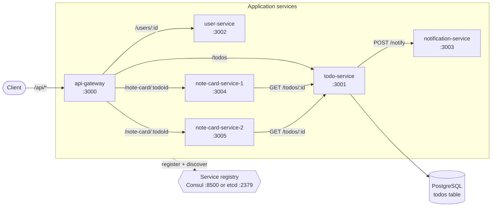
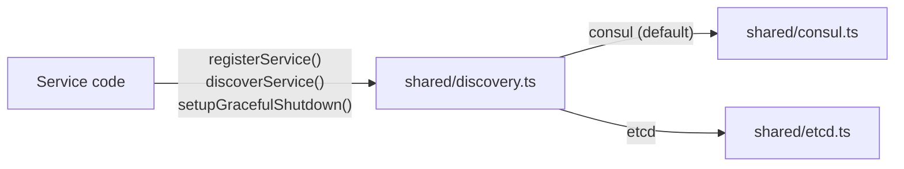
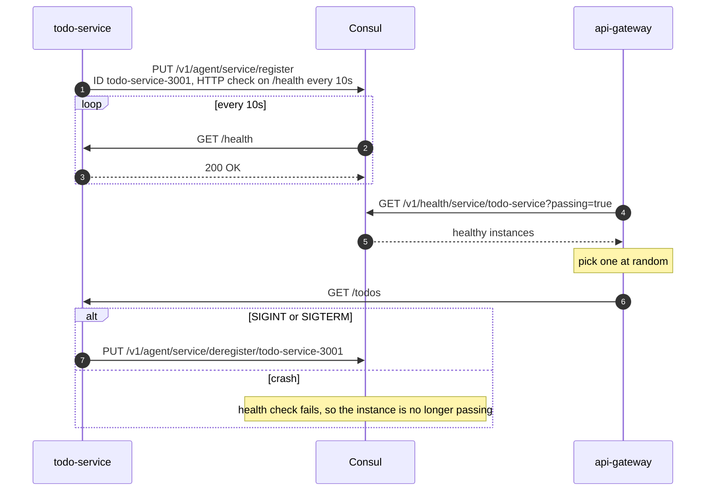
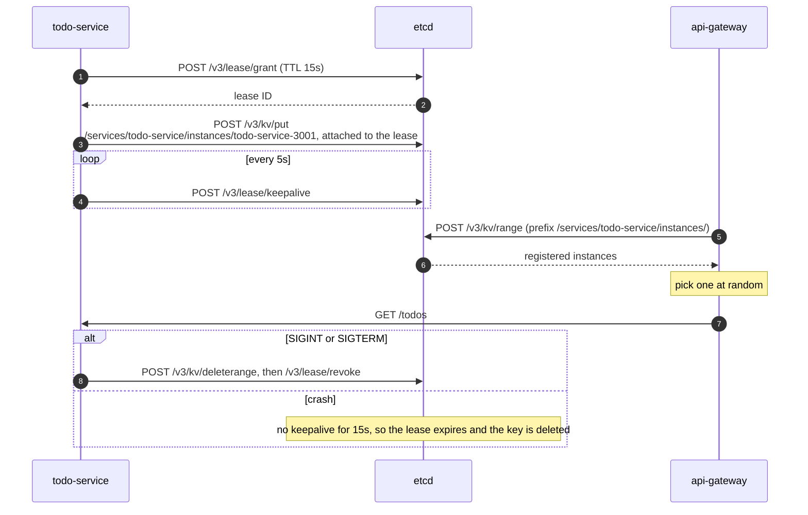
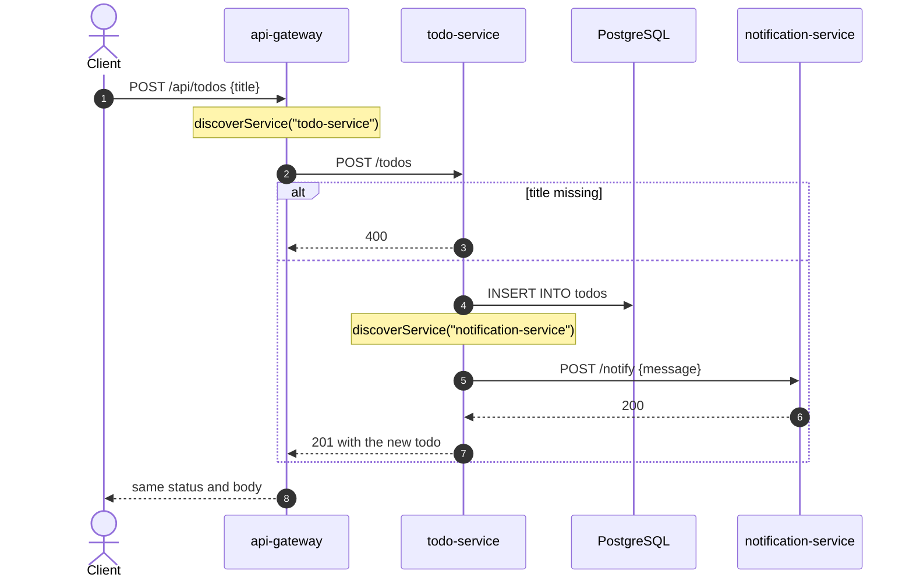
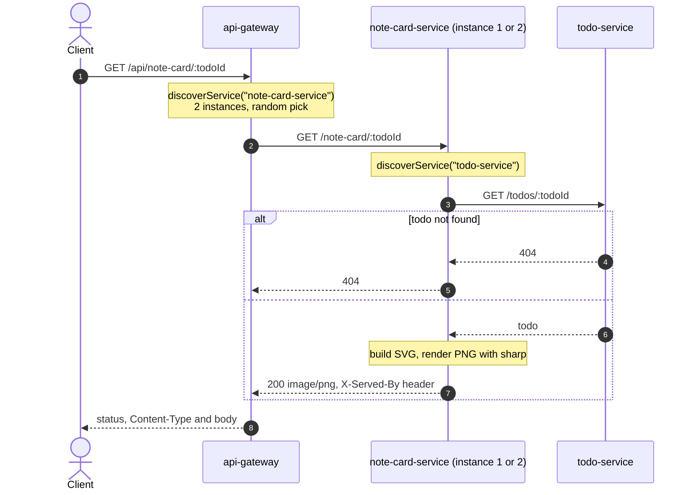

# Architecture

> This copy describes the **`main`** branch. Each feature branch has its own copy of this file, extended with what that branch adds:
>
> | Branch | Adds |
> |---|---|
> | `main` | HTTP microservices, PostgreSQL, client-side discovery with Consul or etcd |
> | `feature/saga-pattern` | RabbitMQ, `saga-orchestrator`, orchestration and choreography sagas |
> | `feature/kubernetes` | Kubernetes manifests and a DNS-based discovery backend |
> | `feature/k8s-service-mesh` | Linkerd sidecars, mTLS, retry and timeout policies |

The diagrams are [Mermaid](https://mermaid.js.org/). GitHub renders them inline, and [mermaid.live](https://mermaid.live) is handy for editing them.

## System overview

- Solid arrows are HTTP calls. Every service registers itself in the registry on startup, and every caller looks up a healthy instance before each call (dotted arrow).
- `note-card-service` runs as two instances under one service name. Callers pick one of them at random.
- `user-service` serves three hardcoded users, and `notification-service` only logs what it receives.
- `todo-service` creates the `todos` table (`id`, `title`, `completed`) on startup. It retries 5 times, 2s apart, while PostgreSQL starts.

The gateway is the only entry point:

| Gateway route | Forwards to |
|---|---|
| `GET /api/todos`, `POST /api/todos` | todo-service `/todos` |
| `GET /api/todos/:id`, `DELETE /api/todos/:id` | todo-service `/todos/:id` |
| `GET /api/users/:id` | user-service `/users/:id` |
| `GET /api/note-card/:todoId` | note-card-service `/note-card/:todoId` (binary passthrough) |

If discovery or the downstream call throws, the gateway answers `503 {"error": "<service> unavailable"}`.

## Service discovery

Services never hardcode each other's addresses. They import [`shared/discovery.ts`](../shared/discovery.ts), which loads a backend at startup based on `DISCOVERY_BACKEND`:

Both backends use **client-side discovery**: the registry returns every live instance, and the caller picks one at random. That random pick is what spreads traffic across the two note-card instances.

### Consul

Consul owns the health checks. It polls each instance's `/health` endpoint and only returns instances whose check passes.

### etcd

etcd is only a key-value store, so a service proves it is alive by renewing a lease. If the renewals stop, etcd deletes the key.

### Consul vs etcd

| | Consul ([`consul.ts`](../shared/consul.ts)) | etcd ([`etcd.ts`](../shared/etcd.ts)) |
|---|---|---|
| Who checks health | Consul polls `/health` (server-side) | The service renews its lease (client-side) |
| Registration | One API call | Grant a lease, put the key, start a keepalive timer |
| Discovery query | `GET /v1/health/service/{name}?passing=true` | Prefix range on `/services/{name}/instances/` |
| A crashed instance disappears after | The next failed check (every 10s) | The lease TTL (15s) |
| State kept inside the service | None | Lease ID and keepalive timer |

## Request flows

### Create a todo

`todo-service` waits for the notification call, but if it fails the error is only logged. The todo is already saved, so a notification failure doesn't fail the request.

### Render a note card

The serving instance's ID is drawn on the card. The gateway copies only `Content-Type`, so the `X-Served-By` header is visible only when you call an instance directly on `:3004` or `:3005`.

## Running the stack

| Compose file | Registry | Containers |
|---|---|---|
| [`docker-compose.yml`](../docker-compose.yml) | Consul 1.15 dev agent on `:8500` (includes the UI) | postgres, consul, api-gateway, todo-service, user-service, notification-service, note-card-service-1, note-card-service-2 |
| [`docker-compose.etcd.yml`](../docker-compose.etcd.yml) | etcd on `:2379`, with `DISCOVERY_BACKEND=etcd` on every service | The same, with etcd instead of consul |

Each service registers under its `SERVICE_ADDRESS` (its compose service name), so the registry hands out hostnames on the Docker network. Every container also publishes its port on the host.
